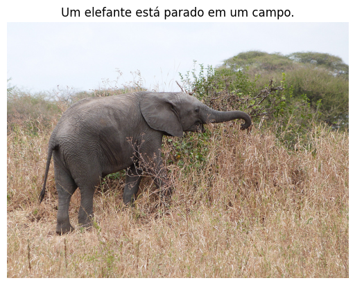

# 🎉 Swin-GPorTuguese-2 for Brazilian Portuguese Image Captioning

Swin-GPorTuguese-2 model trained for image captioning on [Flickr30K Portuguese](https://huggingface.co/datasets/laicsiifes/flickr30k-pt-br) (translated version using Google Translator API)
at resolution 224x224 and max sequence length of 1024 tokens.


## 🤖 Model Description

The Swin-GPorTuguese-2 is a type of Vision Encoder Decoder which leverage the checkpoints of the [Swin Transformer](https://huggingface.co/microsoft/swin-base-patch4-window7-224)
as encoder and the checkpoints of the [GPorTuguese-2](https://huggingface.co/pierreguillou/gpt2-small-portuguese) as decoder.
The encoder checkpoints come from Swin Trasnformer version pre-trained on ImageNet-1k at resolution 224x224.

The code used for training and evaluation is available at: https://github.com/laicsiifes/ved-transformer-caption-ptbr. In this work, Swin-GPorTuguese-2
was trained together with its buddy [Swin-DistilBERTimbau](https://huggingface.co/laicsiifes/swin-distilbert-flickr30k-pt-br). 

Other models evaluated did not perform as well as Swin-DistilBERTimbau and Swin-GPorTuguese-2, namely: DeiT-BERTimbau,
DeiT-DistilBERTimbau, DeiT-GPorTuguese-2, Swin-BERTimbau, ViT-BERTimbau, ViT-DistilBERTimbau and ViT-GPorTuguese-2.

## 🧑‍💻 How to Get Started with the Model

Use the code below to get started with the model.

```python
import requests
from PIL import Image

from transformers import AutoTokenizer, AutoImageProcessor, VisionEncoderDecoderModel

# load a fine-tuned image captioning model and corresponding tokenizer and image processor
model = VisionEncoderDecoderModel.from_pretrained("laicsiifes/swin-gportuguese-2")
tokenizer = AutoTokenizer.from_pretrained("laicsiifes/swin-gportuguese-2")
image_processor = AutoImageProcessor.from_pretrained("laicsiifes/swin-gportuguese-2")

# preprocess an image
url = "http://images.cocodataset.org/val2014/COCO_val2014_000000458153.jpg"
image = Image.open(requests.get(url, stream=True).raw)
pixel_values = image_processor(image, return_tensors="pt").pixel_values

# generate caption
generated_ids = model.generate(pixel_values)
generated_text = tokenizer.batch_decode(generated_ids, skip_special_tokens=True)[0]
```

```python
import matplotlib.pyplot as plt

# plot image with caption
plt.imshow(image)
plt.axis("off")
plt.title(generated_text)
plt.show()
```



## 📈 Results

The evaluation metrics CIDEr-D, BLEU@4, ROUGE-L, METEOR and BERTScore
(using [BERTimbau](https://huggingface.co/neuralmind/bert-base-portuguese-cased)) are abbreviated as C, B@4, RL, M and BS, respectively.

|Model|Dataset|Eval. Split|C|B@4|RL|M|BS|
|:---:|:------:|:--------:|:-----:|:----:|:-----:|:----:|:-------:|
|Swin-DistilBERTimbau|Flickr30K Portuguese|test|66.73|24.65|39.98|44.71|72.30|
|Swin-GPorTuguese-2|Flickr30K Portuguese|test|64.71|23.15|39.39|44.36|71.70|

## 📋 BibTeX entry and citation info

```bibtex
@inproceedings{bromonschenkel2024comparative,
  title={A Comparative Evaluation of Transformer-Based Vision Encoder-Decoder Models for Brazilian Portuguese Image Captioning},
  author={Bromonschenkel, Gabriel and Oliveira, Hil{\'a}rio and Paix{\~a}o, Thiago M},
  booktitle={2024 37th SIBGRAPI Conference on Graphics, Patterns and Images (SIBGRAPI)},
  pages={1--6},
  year={2024},
  organization={IEEE}
}
```